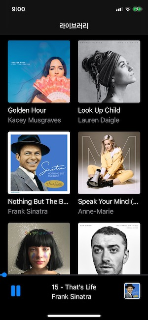

# MusicPlayer
like Apple Music

작성자 : 이한형
목표 : Apple Music앱과 유사하게 만들어보기

{: width="40%" height="40%"}
[음악리스트](./ScreenShots/img2.jpeg){: width="40%" height="40%"
[음악컨트롤](./ScreenShots/img3.jpeg){: width="40%" height="40%"

### 개발 히스토리

##1. 구현
- 최대한 Swift Standard Library 사용하려 함
- MediaPlayer Framwork 사용
- 최대한 Apple Music앱과 비슷하게 동작하도록 노력함.
- MusicService에서 MusicPlayer을 가지고 있으며, 관련 변경사항 알림을 보내는 구조
- 화면을 구성하는 뷰컨트롤러는 MusicService에서 정보를 받아서 출력

##2. 개발환경
- Xcode 11 이상, Swift 5 이상

##3. 오픈소스
- ESTMusicIndicatorView

##4. 아쉬운 점
- UITest 등 최적화를 못 함
- Apple Music 같은 부드러운 애니메이션의 부재
- 
